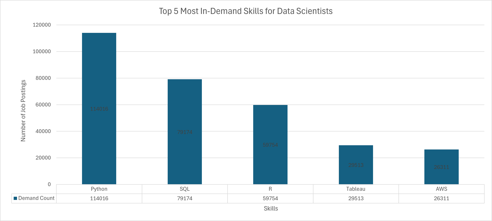
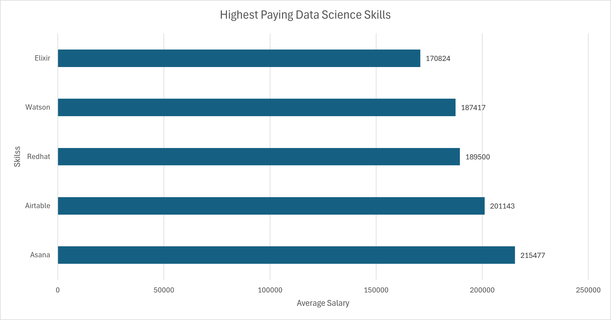
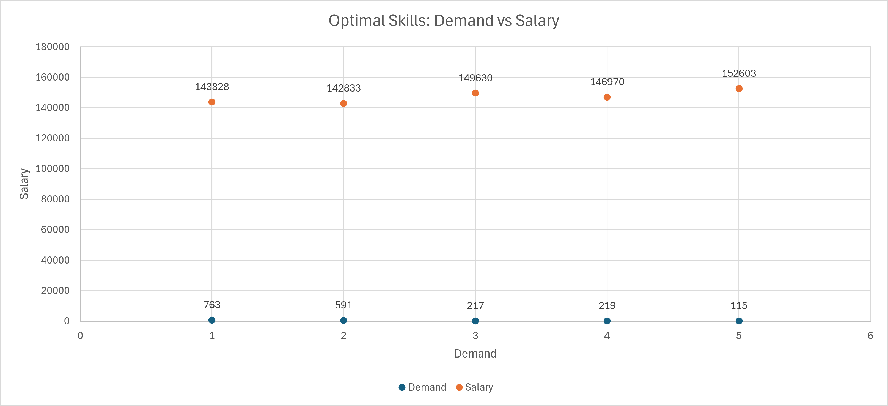

# SQL Data Analysis Project: Exploring the Data Science Job Market

## Introduction

This project explores a dataset of Data Scientist job postings to uncover trends in salaries, skill demand, and career opportunities within the data science field. Using PostgreSQL and SQL, I analyzed thousands of job postings to identify the highest-paying roles, the most in-demand skills, and the skills that offer the strongest combination of demand and earning potential.

The project demonstrates how SQL can be used to transform raw data into actionable insights that support career planning and data-driven decision-making.

---

## Background

The Data Science job market continues to evolve rapidly, with employers seeking a combination of technical, analytical, and cloud computing skills. With hundreds of tools and technologies available, aspiring Data Scientists often struggle to identify which skills are most valuable to learn.

This project aims to answer five key questions:

1. What are the highest-paying Data Scientist jobs?
2. What skills are associated with those high-paying jobs?
3. What skills are most in demand?
4. Which skills command the highest salaries?
5. What are the most optimal skills to learn based on both demand and salary?

---

## Tools Used

* **SQL** – Data extraction, transformation, and analysis
* **PostgreSQL** – Database management and querying
* **Visual Studio Code (VS Code)** – SQL development environment
* **Git & GitHub** – Version control and project documentation

---

## Project Workflow

```text
Raw Job Posting Data
        ↓
 Data Cleaning
        ↓
 SQL Analysis
        ↓
 Salary Analysis
        ↓
 Skill Demand Analysis
        ↓
 Data Visualization
        ↓
 Career Insights & Recommendations
```

---

# The Analysis

## 1. Top Paying Data Scientist Jobs

This analysis identified the highest-paying remote Data Scientist positions in the dataset.

| Job Title                                          | Company            | Average Annual Salary ($) |
| -------------------------------------------------- | ------------------ | ------------------------: |
| Staff Data Scientist/Quant Researcher              | Selby Jennings     |                   550,000 |
| Staff Data Scientist - Business Analytics          | Selby Jennings     |                   525,000 |
| Data Scientist                                     | Algo Capital Group |                   375,000 |
| Head of Data Science                               | Demandbase         |                   351,500 |
| Head of Data Science                               | Demandbase         |                   324,000 |
| Director Level - Product Management - Data Science | Teramind           |                   320,000 |
| Director of Data Science & Analytics               | Reddit             |                   313,000 |
| Head of Battery Data Science                       | Lawrence Harvey    |                   300,000 |
| Director of Data Science                           | Storm4             |                   300,000 |
| Distinguished Data Scientist                       | Walmart            |                   300,000 |

### Key Insights

* The highest-paying role offered an annual salary of **$550,000**.
* Senior leadership positions dominated the highest-paying opportunities.
* Remote Data Scientist roles can offer exceptionally competitive compensation.

---

## 2. Top Paying Job Skills

This analysis examined the skills most frequently associated with the highest-paying Data Scientist positions.

| Skill      | Frequency |
| ---------- | --------: |
| Python     |         4 |
| SQL        |         3 |
| AWS        |         2 |
| Java       |         2 |
| Spark      |         2 |
| TensorFlow |         2 |
| PyTorch    |         2 |

### Key Insights

* **Python** was the most common skill among top-paying jobs.
* **SQL** remained a core requirement even for senior-level positions.
* Cloud technologies and machine learning frameworks consistently appeared among high-paying roles.

---

## 3. Top Demanded Skills



This analysis identified the skills most frequently requested by employers hiring Data Scientists.

| Skill   | Demand Count |
| ------- | -----------: |
| Python  |      114,016 |
| SQL     |       79,174 |
| R       |       59,754 |
| Tableau |       29,513 |
| AWS     |       26,311 |

### Key Insights

* Python emerged as the most sought-after skill in the dataset.
* SQL remains a foundational skill for Data Science roles.
* Data visualization and cloud computing skills continue to be highly valued.

---

## 4. Top Skills Based on Salary



To determine the most financially rewarding skills, I calculated the average salary associated with each skill.

| Skill         | Average Salary ($) |
| ------------- | -----------------: |
| Asana         |            215,477 |
| Airtable      |            201,143 |
| RedHat        |            189,500 |
| Watson        |            187,417 |
| Elixir        |            170,824 |
| Lua           |            170,500 |
| Slack         |            168,219 |
| Solidity      |            166,980 |
| Ruby on Rails |            166,500 |
| RShiny        |            166,436 |

### Key Insights

* Specialized technologies often command premium salaries.
* AI, machine learning, and cloud-related skills continue to provide strong earning potential.
* The highest-paying skills are not always the most commonly requested.

---

## 5. Optimal Skills to Learn



This analysis combined demand and salary data to identify the skills that offer the strongest balance between employability and earning potential.

| Skill      | Demand Count | Average Salary ($) |
| ---------- | -----------: | -----------------: |
| Python     |          763 |            143,828 |
| SQL        |          591 |            142,833 |
| R          |          394 |            137,885 |
| Tableau    |          219 |            146,970 |
| AWS        |          217 |            149,630 |
| Spark      |          149 |            150,188 |
| TensorFlow |          126 |            151,536 |
| Azure      |          122 |            142,306 |
| PyTorch    |          115 |            152,603 |
| Pandas     |          113 |            144,816 |

### Key Insights

* Python and SQL provide the strongest combination of demand and salary.
* Cloud platforms such as AWS and Azure continue to be highly valuable.
* Machine learning frameworks such as TensorFlow and PyTorch command above-average salaries.
* Data engineering skills remain highly marketable.

### Career Recommendation

For aspiring Data Scientists, the most strategic skills to learn are:

1. Python
2. SQL
3. Tableau or Power BI
4. AWS or Azure
5. TensorFlow / PyTorch
6. Spark and other data engineering tools

---

## What I Learned

Through this project, I strengthened my skills in:

* Writing complex SQL queries using JOINS, CTEs, and aggregate functions
* Data cleaning and transformation
* Salary and skill demand analysis
* Translating business questions into SQL solutions
* Creating data-driven career recommendations
* Using Git and GitHub for project documentation and version control

---

## Conclusion

This project demonstrates how SQL can be used to uncover meaningful insights from job market data.

The analysis revealed that while niche technologies often command the highest salaries, foundational skills such as Python, SQL, and cloud platforms provide the best combination of market demand and earning potential.

For individuals pursuing a career in Data Science, focusing on these high-value skills can significantly improve both employability and long-term career growth.
